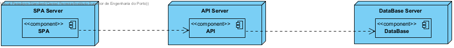
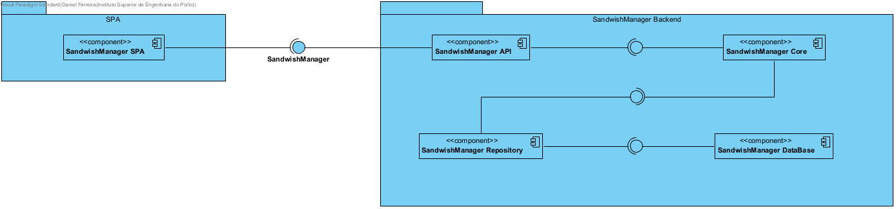
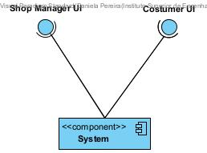
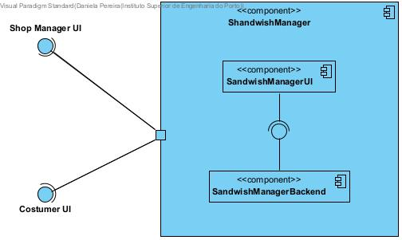
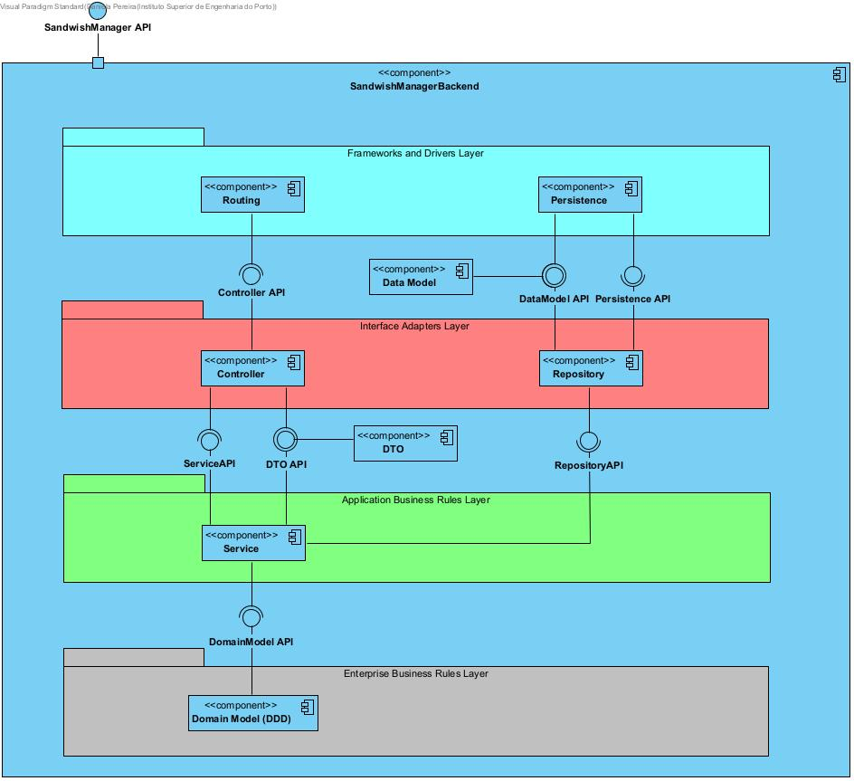
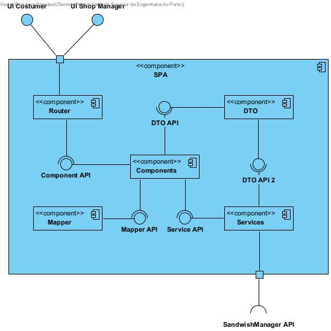

# Iteration #1
## Step1 : Review Inputs

Analyze the drivers acquired from the Stakeholders and inquires to the PL teacher to better understand the requirements for the project.

## Step2 : Iteration Goals

On this iteration we decided to address: 

- domain model for the application 
- constraints related with the infrastructure  
- quality attributes related with the infrastructure

## 2.1 Goal

- CRN1: Establishing an overall initial system structure
- CRN2: Some team elements inexperience with a Spring-based systems
- CRN3: The teams reduced size 
- CRN4: Allocate the tasks to the members of the team
- CRN5: Achiving the goal for the quality standards in a short amount of time
- CON1: The system is developed using Open-Source Technologies
- CON2: The application should be available in the near four weeks
- CON3: The system must achive at least 70% of the level calculated for the code quality standards, through the Sonargraph-Explorer
- CON4: The API is to be then accessible through a single page application (SPA)
- CON5: The application must use Spring Technology
- CON6: The system must ensure 99% of unauthorized login attempts are detected
- QA1, CON7: The application must run on several browsers and devices.
- QA2 : Usage of Domain Primitives
- QA3 : The application must be suitable for future modification
- QA4 : The system must achive at least 70% of the level calculated for the code quality standards, through the Sonargraph-Explorer

### 2.1.1 Importance to the Customer and Difficulty of Implementation according to the Architect

| Scenario ID | Importance to the Customer | Difficulty of Implementation according to the Architect |
| ----------- | -------------------------- | ------------------------------------------------------- |
| CRN1        | Low                        | Medium                                                  |
| CRN2        | Medium                     | High                                                    |
| CRN3        | Low                        | High                                                    |
| CRN4        | Low                        | Medium                                                  |
| CRN5        | Medium                     | High                                                    |
| CON1        | High                       | Low                                                     |
| CON2        | High                       | High                                                    |
| CON3        | Low                        | Medium                                                  |
| CON4        | High                       | Low                                                     |
| CON5        | High                       | High                                                    |
| CON6        | High                       | High                                                    |
| QA1,CON7    | Low                        | High                                                    |
| QA2         | Low                        | Medium                                                  |
| QA3         | Low                        | High                                                    |
| QA4         | High                       |    High    |                                  

## Step3: What to Refine

Since this is the first iteration, there are none elements to refine.

## Step4: Design concepts that satisfys the selected drivers

To satisfy the given drivers we ended up choosing the three layer architecture, this means that we are going to build:  

- SPA   
- Backend onion architecture  
- DB

| Design Decisions and Location | Rationale                                                    | Alternatives                            |
| ----------------------------- | ------------------------------------------------------------ | --------------------------------------- |
| Backend                       | The team experience regarding Spring Boot applications is growing, therefore we decide to keep to client requirement. | None                                    |
| SPA                           | We consider the experience of the team with such applications and concluded that Angular was the middle term for us all. | React, Vue.js, Next.js                  |
| DB                            | To manage all the dynamic information for the system, we decided to use JPA  because it is easier to integrate with Java Spring Boot and we can easily find support for impediments during development. | Postgres, MySQL, MS SQL Server, MONGODB |
| Deployment                            | In order to deploy, manage and scale the application we decided to used the cloud platform Heroku. This decision was based on past developments in wich the process of CI/CD was managed trough Heroku, hence the team feels more comfortable. | Firebase, AWS, Azure, Netlify |
| Security                            | Analysing the different options to manage security, JWT was found unanimously the best one. Not only because some of the elements have configured APIs using this protocol, but because the learning curve is steeper. | Oauth 2.0, Api Keys |

## Step5: Instantiate architectural elements, allocate responsibilities and define interfaces

Presentation Layer: Display the UI and facilitate user interaction. What the user will see from the application;

Service Layer: Middleware between Presentation and Business layer. This allows to keep the business layer intact when exposing application functionality. No business rules should be included here.

Business Layer: Application core where all the business logic and workflows are implemented. Should not be exposed to the application exterior domain, only when accessed by service layer.

Data Layer: Data layer to abstract the business layer of the all data logic and management.

## Step 6: Sketch views and record design decisions

### Domain Model

### Deployment Diagram

### Logical Views

### Logical View Level 1

### Logical View Level 2

### Logical View Level 3 - Backend

### Logical View Level 3 - SPA

## Step 7: Analys current design and review iteration goals

| |Iteration 1| |
|:---:|:---:| :---: |
| Not Addressed | Partially Addressed| Completely Addressed|
|CRN2|CRN4|CRN1|
|CRN5|CON1|CRN3|
|CON3|CON2|CON5|
|CON4|QA1,CON7| - |
|CON6|QA2| - |
|QA3| - | - |
|QA4| - | - |
