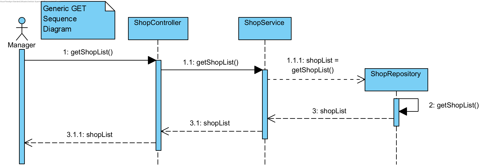
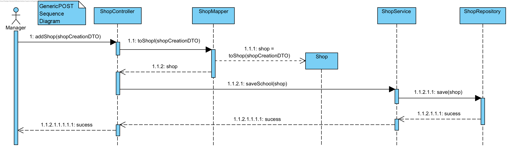
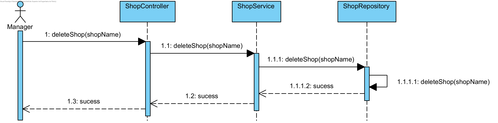
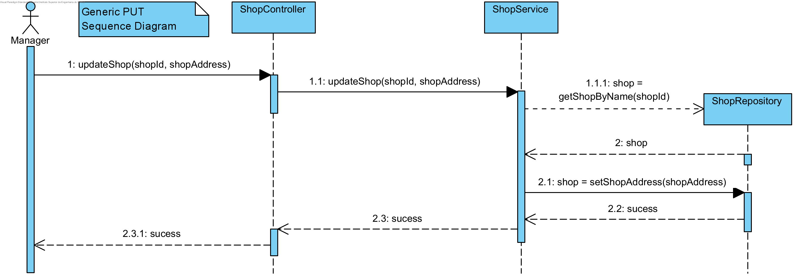
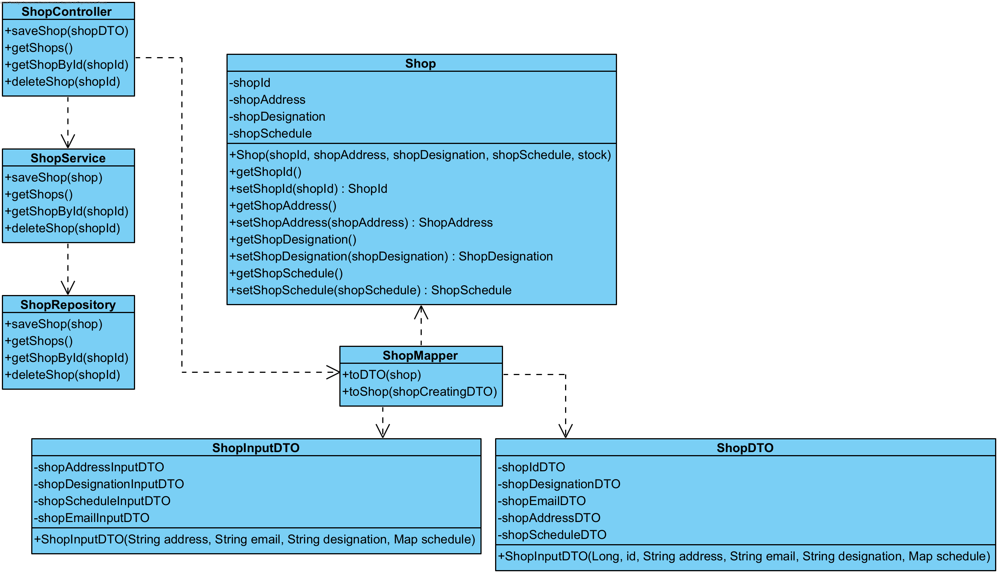
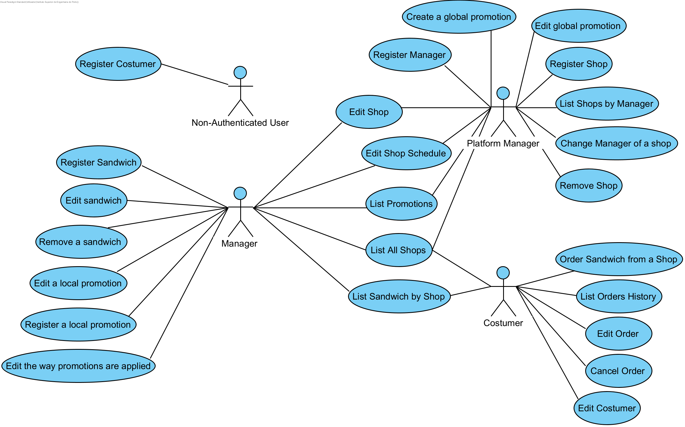

# ADD - Iteration 2

## Step 1: Considered Inputs

| Driver Type | Description                                                  |
| ----------- | ------------------------------------------------------------ |
| UC's        | All                                                          |
| Concerns    | CRN1: Establishing an overall initial system structure.      |
|             | CRN2: Some team elements inexperience with a Spring-based systems |
|             | CRN3: The teams reduced size                                 |
|             | CRN4 : Allocate the tasks to the members of the team         |
|             | CRN5 : Achiving the goal for the quality standards in a short amount of time |
| Constraints | CON1: The system is developed using Open-Source Technologies. |
|             | CON2: The application should be available in the near four weeks. |
|             | CON3: The system must achive at least 70% of the level calculated for the code quality standards, through the Sonargraph-Explorer |
|             | CON4: The API is to be then accessible through a single page application (SPA). |
|             | CON5 : The application must use Spring Technology            |
|             | CON6 : The system must ensure 99% of unauthorized login attempts are detected |
|             | CON7 :  The application must run on several browsers and devices |

## Step 2: Iteration Goal

This iteration goal is to support primary functionality.

## Step 3: Elements to decompose/refine

- Decompose and refine elements from the reference architecture and deployment pattern 
  selected in the previous iteration. Detail and document how different components from different layers
  interact and behave to enable desired application functionality.
- Further specify application presentation layer to be in line with some UI expectations.
- Domain Model

## Step 4: Design Concepts

### Domain model

The domain model will be specified by DDD standards with the use of Value Objects, Entities and Aggregates.
This will not only further increase the project team knowledge in the application target domain, but also to understand the best way to organize the system primary functionality.

### Domain objects

Domain objects / Components that will be utilized by each UC should be specified.
This can be achieved by designing SD diagram for a specific UC as well as identifying, explaining and reasoning each one of the components that are split between the multiple application layers.

## Step 5: Instantiate architectural elements, allocate responsibilities and define interfaces

### UC

| Element        | Responsibility                                               |
| -------------- | ------------------------------------------------------------ |
| ShopController | Handle HTTP requests. Application entry point                |
| ShopDTO        | Shop deprived of any business logic that will be exposed to the exterior through the controller. Can be described as a bag of data. |
| ShopService    | Shop service to abstract business logic and access to ShopController. This enables the change of funcionality without, necesseraly, changing the business core of the application. |
| ShopMapper     | Handles Shop to ShopDTO conversion.                          |
| Shop           | Shop domain entity representation.                           |
| ShopRepository | Shop repository. Consists in an abstraction to the data layer, enabling the application to use other database in the future if there is a need for it. |

This can be extended for other UC/Aggregates.

## Step 6: Sketch views and record design decisions

### Sequence Diagram - GET

### Sequence Diagram - POST

### Sequence Diagram - DELETE

### Sequence Diagram - PUT

### Class diagram

### Domain model

### Use Case Diagram

| ID   | Description                            | Actor                               | Priority |
| ---- | -------------------------------------- | ----------------------------------- | -------- |
| US1  | Register in the platform as a Manager  | Platform Manager                    | High     |
| US2  | Register in the platform as a Costumer | Non-Authenticated User              | High     |
| US3  | Change Manager of a Shop               | Platform Manager                    | High     |
| US4  | Register Shop                          | Platform Manager                    | High     |
| US5  | Edit Shop                              | Platform Manager, Manager           | Medium   |
| US6  | Edit Costumer                          | Costumer                            | Medium   |
| US7  | Remove Shop                            | Platform Manager                    | Medium   |
| US8  | List all Shops                         | Platform Manager, Manager, Costumer | High     |
| US9  | Create global promotions               | Platform Manager                    | High     |
| US10 | Edit global promotions                 | Platform Manager                    | Medium   |
| US11 | Create local Promotion                 | Manager                             | High     |
| US12 | Edit local Promotion                   | Manager                             | Medium   |
| US13 | Edit Promotion Application             | Manager                             | Medium   |
| US14 | List Promotions                        | Manager, Costumer                   | Low      |
| US15 | Register Sandwich                      | Manager                             | High     |
| US16 | Edit Sandwich                          | Manager                             | Medium   |
| US17 | Remove Sandwich                        | Manager                             | High     |
| US18 | List all Sandwiches from Shop          | Manager, Costumer                   | High     |
| US19 | Order Sandwich                         | Costumer                            | High     |
| US20 | Edit Order                             | Costumer                            | Medium   |
| US21 | Cancel Order                           | Costumer                            | High     |
| US22 | List Order History                     | Costumer                            | Low      |

### Design decisions

| Design decision                                              | Rationale                                                    |
| ------------------------------------------------------------ | ------------------------------------------------------------ |
| Use of domain objects as well decomposing them between all layers | Provide at least one example of domain objects in each of the defined application layers, maybe even with a use case context. This will be important to provide context to the previous chosen architecture and pattern. |
| Use Spring framework                                         | CON5                                                         |
| Use Angular for the front-end/ UI of the application         | CON7                                                         |
| Class Date                                                   | The class Date is no long a Service and is an attribute from Order and Promotion. In this context, Date has some conditions and business rules that doesn't allow the group to set as a Service. |
| Class Amount                                                 | The class Amount is no long a Service and is an attribute from Order. In this context, Amount has some conditions and business rules that doesn't allow the group to set as a Service. |
| Delete Aggregate Stock                                       | For this project, stock isn't one of the main concerns so instead of being an aggregate is an entity that belongs to the aggregate Shop |
| Class Email and Name                                         | The manager and the costumer share the same conditions and business rules regarding the email and name classes. The group decided to create a single email and name class to avoid code duplication. |

### Quality decisions

| ID   | Quality Attribute                       | Scenario                                                     | Associated Use Stories |
| ---- | --------------------------------------- | ------------------------------------------------------------ | ---------------------- |
| QA1  | Usability,Performance                   | The application must run on several browsers and devices     | All User Stories       |
| QA2  | Security, Modifiability                 | Usage of Domain Primitives                                   | All User Stories       |
| QA3  | Modifiability                           | The application must be suitable for future modification     | All User Stories       |
| QA4  | Testability, Performance, Modifiability,Maintainbility | The system must achive at least 70% of the level calculated for the code quality standards, through the Sonargraph-Explorer | All User Stories       |

## Step 7: Perform analysis of current design and review iteration goal and design objectives

### Updated Kanban board

|               |     Iteration 2     |                      |
| :-----------: | :-----------------: | :------------------: |
| Not Addressed | Partially Addressed | Completely Addressed |
|     CRN2      |        CON1         |         CRN1         |
|     CRN5      |        CON2         |         CRN3         |
|     CON3      |         QA3         |         CRN4         |
|     CON4      |          -          |         CON5         |
|     CON6      |          -          |       QA1,CON7       |
|      QA4      |          -          |         QA2          |
