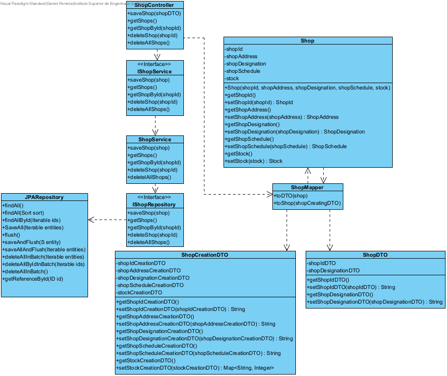
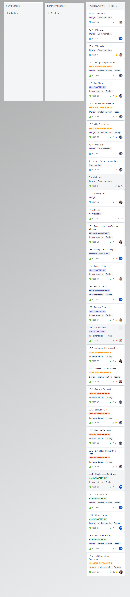
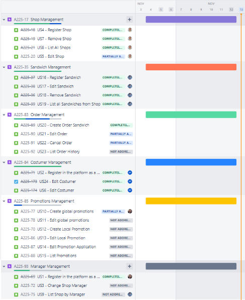

# ADD - Iteration 3

## Step 1: Considered Inputs

| Driver type        | Description                                                  |
| ------------------ | ------------------------------------------------------------ |
| Concerns           |  CRN5: Achiving the goal for the quality standards in a short amount of time                      |
| Quality attributes |  QA4 : The application must be suitable for future modification|
|                    |  QA5 : The system must achive at least 70% of the level calculated for the code quality standards, through the Sonargraph-Explorer |

## Step 2: Iteration Goal

- In this third iteration the goal is to re-evaluate the structure to confirm that supports all the primary functionalities;
- Implement all the primary functionalities;
- Integrate the Sonargraph-Explorer;
- Guarantee that the code standards are at least 70%.

## Step 3: Elements to decompose/refine

- Decide how functionality tests will be addressed.

## Step 4: Design Concepts

| Design decisions and location                                | Rationale                                                    |
| ------------------------------------------------------------ | ------------------------------------------------------------ |
| Introduce modifiability tactics, more precisely, introduce Defer binding time - Polymorphism tactic to application repository / data layer | This will allow for database technology to be changed later on the application lifecycle without greatly impacting previous functionality |
| Introduce high cohesion and low coupling tactics | This will allow the solution to be more robust and easier to maintain and modify. | 
| Introduce Builder pattern, fail fast, failing for a good state and immutability | Satisfy in order to ensure a more secure solution design        |

## Step 5: Instantiate architectural elements, allocate responsibilities and define interfaces

### Shop Aggregate

| Element            | Responsibility                                               |
| ------------------ | ------------------------------------------------------------ |
| ShopController | Example of a controller implementation, responsible for the endpoints that connects the solution with it's exterior requests. |
| IShopService | Example of a service's interface implementation, which adds another layer of abstraction guaranteeing that the Controller and the Service do not contact with each other. |
| ShopService | Example of a service implementation, responsible for managing the requests and proccessing them. |
| IShopRepository | This will now be an interface that should be implemented for each of the diferent data layer technologies used. |
| ShopRepository | Example of a repository implementation. In this case this is a JPA repository.                                                    |
| ShopEntity | JPA Entity. Main objective is to detach JPA annotations from DDD entities. |
| ShopDTO | Data Transfer Object responsible to circulate throughout the solution. Represents another layer of abstraction since does not carry sensible information.
| ShopMapper| Class do map domain entities to JPA entities. |
| ShopTests | Unit tests using JUnit to test sandwich functionality. |

## Step 6: Sketch views and record design decisions

### Class diagram updated - Shop

### Design decisions

| Design decision                                              | Rationale                                                    |
| ------------------------------------------------------------ | ------------------------------------------------------------ |
| Widespread use of interfaces and implementation of these for specific technology purprose (SandwichRepository-SandwichRepositoryJPA) | QA4, make the application as modifiable as possible allowing the introduction of new database technologies later on the lifecycle. |
| Develop unit tests                                           | CRN5, to ensure the core application code is behaving and most probably will behave as expected. |
| Use of ValueObjects from DDD to introduce some type of immutability | QA2, follow developed domain model.                        |
| Fail fast                                                    | Detect input errors the fast as possible to ensure no invalid value get to the lower layers of the solution. |
| JPA Criteria API Queries                                     | use of JPA Criteria API queries when doing database queries which increase application security when it comes to SQL injection |

## Step 7: Perform analysis of current design and review iteration goal and design objectives

### Updated Kanban board

|               |     Iteration 3     |                      |
| :-----------: | :-----------------: | :------------------: |
| Not Addressed | Partially Addressed | Completely Addressed |
|       -       |      QA1,CON7       |         CRN1         |
|       -       |          -          |         CON1         |
|       -       |          -          |         CRN2         |
|       -       |          -          |         CON2         |
|       -       |          -          |         CRN5         |
|       -       |          -          |         QA4          |
|       -       |          -          |        CON3 , QA5    |
|       -       |          -          |         CRN3         |
|       -       |          -          |         CRN4         |
|     CON4      |          -          |         CON5         |
|     CON6      |          -          |         QA2          |
|       -       |          -          |          -           |
|       -       |          -          |          -           |

