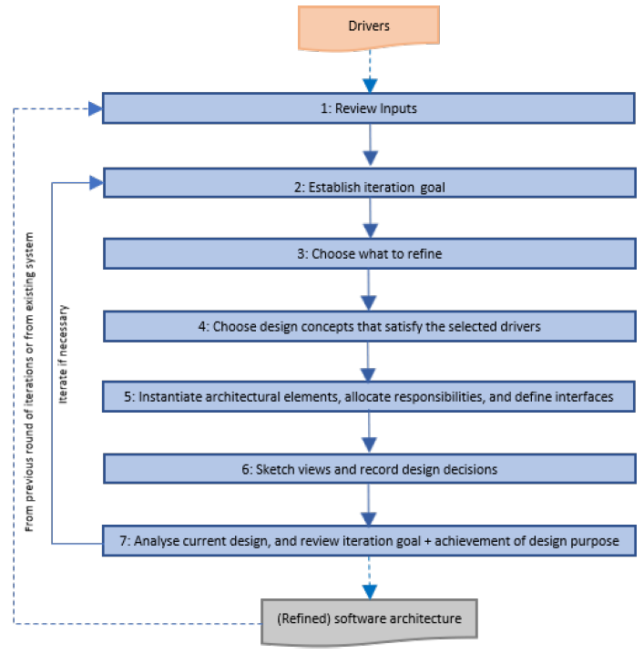

# ADD - Attribute-Driven Design 3.0

The project was planned according to Attribute-Driven Design 3.0.
This is a methodology to create a Software architecture that prioritizes the quality of the attributes of the final product, which is the software to be delivered to the customer.

Then, there is a diagram representing the work flow of the methodology in question.
Initially the requirements are raised - Drivers. It is then scrutinized and processed in several steps until we obtain a refined software architecture.

## Review Inputs:

- In order to correctly carry out this first refinement process, it is necessary to obtain an answer to the following questions:

- Are inputs available and correct? 

- Are all drivers collected? 

- Is it clearly established what is the purpose for the design activities? 

- For brownfield development: is existing architecture design available? 

- Have primary functionality and quality attribute scenarios been prioritized (ideally by the most important project stakeholders)?

- Are initial architectural concerns defined?

  

## Establish the iteration goal by selecting drivers:

Each iteration n (to be made explicit, n varies from 1 to the number of iterations) focuses on achieving a particular goal - clearly identify it.

Such a goal typically involves designing to satisfy a subset of the drivers. For example, an iteration goal could be to create structures from elements that will: 

- support a particular performance scenario; 
- enable a use case to be achieved.

Depending on the type of system whose architecture is being designed, there may be a strongly suggested ordering of the iteration goals that need to be addressed. 

For example, for a greenfield system in a mature domain, your initial goal is typically to identify an overall structure for the system by choosing a reference architecture

## Choose what to refine:

Refinement can mean: 

- decomposition into finer-grained elements (top-down approach);
- combination of elements into coarser-grained elements (bottom-up approach);
- improvement of previously identified elements.

For greenfield development, establishing the system context can be the start and then selecting the only available element—that is, the system itself—for refinement by decomposition.

For existing systems or for later design iterations in greenfield systems, it is normal to choose to refine elements that were identified in prior iterations.

## Choose design concepts that satisfy the selected drivers:

To choose design concepts that satisfy the selected drivers, it is necessary to attend to some more abstract concepts and others more concrete.

It is necessary to pay attention to and make decisions regarding the following topics:

- Reference Architectures;
- Deployment Patterns;
- Architectural / Design Patterns;
- Tactics;
- Externally developed components (e.g. frameworks).

## Instantiate architectural elements, allocate responsibilities, and define interfaces:

- #### Instanciate architectural elements:

  If the Layers pattern was selected as a design concept, it is needed to decide how many layers will be used, since the pattern itself does not prescribe a specific number. In this example, the layers are the elements that are instantiated. 

  In certain cases, instantiation can mean configuration. 

  For example, you may have dedicated an iteration to selecting technologies and associating them with the elements in your design. In further iterations, you might refine these elements by making finer-grained decisions about how they should be configured to support a particular driver, such as a quality attribute.

- #### Allocate responsabilities:

  After instantiating the elements, you need to allocate responsibilities to each of them. 

  For example, in a typical web-based enterprise system, at least three layers are usually present: the presentation layer, the business layer, and the data layer. 

  The responsibilities of these layers differ: the responsibilities of the presentation layer include managing all of the user interactions, whereas the responsibilities of the data layer include managing the persistence of data.

- #### Define interfaces:

  Instantiating elements is just one of the tasks you need to perform to create structures that satisfy a driver or a concern. 

  The elements that have been instantiated also need to be connected, to allow them to collaborate with one another. This requires the existence of relationships between the elements and the exchange of information through some kind of interface. 

  The interface is a contractual specification of how information should flow between the elements.

  

## Sketch views and record design decisions:

It is important to document the decisions made and represent the design adopted through diagrams. It is common practice to follow the C4 models and the 4+1 architectural views model.

## Analyze current design and review iteration goal + achievement of design purpose

With the design kanban board, it is easy to visually track the advancement of design, and quickly see how many of the (most important) drivers are being or have been addressed in the design round. 

This technique also helps deciding whether additional iterations are needed as, ideally, the design round is terminated when a majority of your drivers (or at least the ones with the highest priority) are located under the “*Completely Addressed*” column.
