# Architecture Tradeoff Analysis Method Document

## Present ATAM Document
The ATAM process consists of gathering stakeholders together to analyze business drivers (system functionality, goals, constraints, desired non-functional properties) and from these drivers extract quality attributes that are used to create scenarios. These scenarios are then used in conjunction with architectural approaches and architectural decisions to create an analysis of trade-offs, sensitivity points, and risks (or non-risks). This analysis can be converted to risk themes and their impacts whereupon the process can be repeated. With every analysis cycle, the analysis process proceeds from the more general to the more specific, examining the questions that have been discovered in the previous cycle, until such time as the architecture has been fine-tuned and the risk themes have been addressed.

## Present Business Drivers
A very innovative organization that aggregates many schools at Porto has become concerned about the food available for its academic community, especially its students, many of whom are displaced from their relatives’ homes, have little economic means, and are not skilled in preparing and cooking healthy meals.

The institution stopped having vending machines that offered food of poor nutritional quality. Instead, affordable meals began to be served in the canteen with delicious lunches and dinners. The sandwiches proved to be of great value, so Gorgeous Sandwich, a company dedicated to healthy sandwiches, was hired to open a new space and sell sandwiches.

Gorgeous Sandwich proved to be a great value for the students due to their nutritious and well made sandwiches.

## Present The Architecture

After an analysis of the problem, the group decided to use Onion Architecture as a solution. Onion Architecture addresses the challenges faced with 3-tier and n-tier architectures, and to provide a solution for common problems. Onion Architecture layers interact to each other by using the Interfaces. Onion Architecture is comprised of multiple concentric layers  interfacing each other towards the core that represents the domain. The  architecture does not depend on the data layer as in classic multi-tier  architectures, but on the actual domain models. At the center of  Onion Architecture is the domain model, which represents the business  and behavior objects. Around the domain layer are other layers, with  more behaviors. The following image is an example of the Onion Architecture:

### Domain Entities

At the center part of the Onion Architecture, the domain layer exists;  this layer represents the business and behavior objects. The idea is to  have all of your domain objects at this core. It holds all application  domain objects.

### Repository Layer

This layer creates an abstraction between the domain entities and  business logic of an application. In this layer, we typically add  interfaces that provide object saving and retrieving behavior typically  by involving a database. Creates a generic repository, and add queries to retrieve data from the  source, map the data from data source to a business entity, and persist  changes in the business entity to the data source.

### Service Layer

The Service layer holds interfaces with common operations, such as Add, Save, Edit, and Delete. Also, this layer is used to communicate between the UI layer and repository layer.

### UI Layer

It’s the outer-most layer, and keeps peripheral concerns like UI and  tests. For a Web application, it represents the Web API or Unit Test  project.

## Identify Architectural Approach

For this solution the onion architecture was used, and the following image shows the various layers of the project developed. 

The Domain Model component is divided between Value Objects and Entities, thus following the Driven Domain Design (DDD) pattern. There are Service and Repository interfaces that link the different layers. There is also the database component which the group decided to use MySQL since it is an open-source tool, a requirement of the statement, and is a relational database. The DTO pattern was also used in order to simplify the data input into the system.
The controller component is responsible for receiving CRUD (Create, Read, Update, Delete) requests from the client.

There is a selection of deployment patterns to choose from:

-	Non distributed deployment:
-	Distributed deployment:
-	Client-server deployment.
-	n-tier deployment(2-tier,3-tier,4-tier).

Due to concern CRN3 and condition CON2, the application must be developed in a short span of time (4 weeks) with a short team so a deployment pattern which allowed for all architecture layers to be implemented simultaneously would greatly reduce the risk of not delivering in time.
Taking the previous statement into consideration, the most adequate for this software solution would be a 2-Tier deployment where Client and database are deployed separately. This would allow all these layers can be developed simultaneously, security could be implemented and modifiability would increase as well.

## Analyze Architectural Approach

### Domain Model

#### Entity:

In domain-driven design, an entity is a representation of an object in the domain. It is defined by its identity, rather than its attributes. It  encapsulates the state of that object through its attributes, including  the aggregation of other entities, and it defines any operations that  might be performed on the entity.

In the following image is an example of an entity of the solution. Each entity represents one table in the database. The primary key of the table is the entity id which is generated automatically. The column names are defined by the Column tag and the various properties such as unique or nullable.

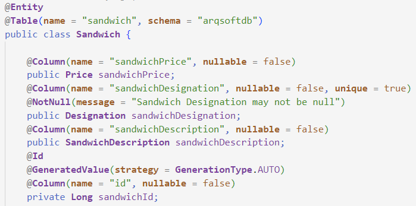

#### Domain

Value Object is an object that represents a concept from your problem Domain. It is important in DDD that Value Objects support and enrich Ubiquitous Language of your Domain. They are not just primitives that represent  some values - they are domain citizens that model behaviour of your  application.

Value Object classes all have an empty constructor with the keyword protected. The filled constructors are instantiated with the set method, and this method is private and is where the business checks are done.

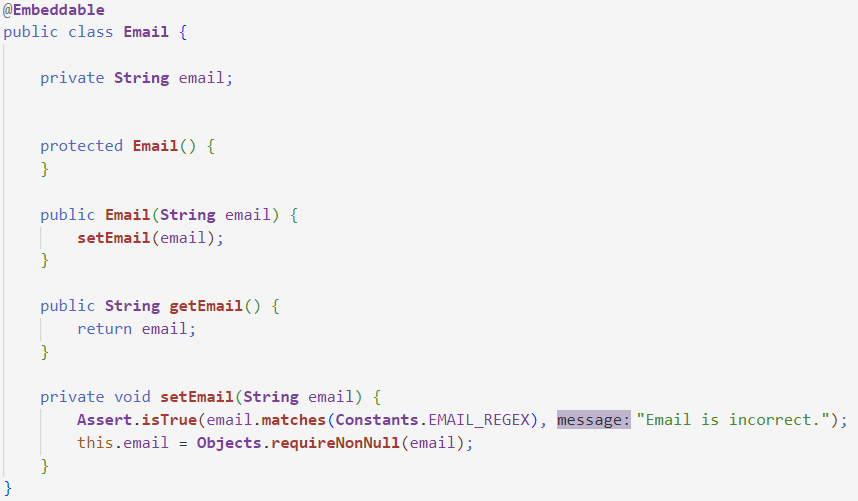

### Controller

Controller is a class that handles user requests. It retrieves data from the Model and renders view as response. The  controller maps requested URL's to the classes that are  referred to as controllers.

Each controller class has his CRUD operations. In the mapping tags the url of the route is presented so that each CRUD operation can be accessed.

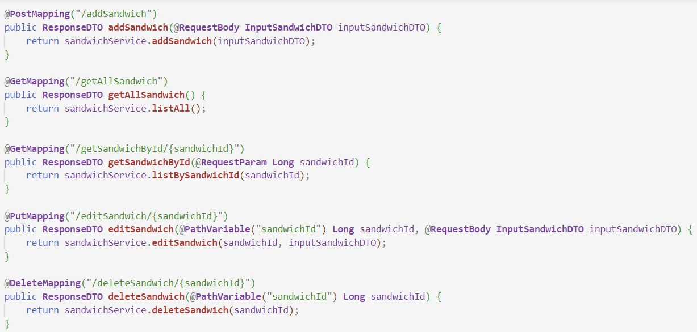

### Service

A service layer is an additional layer in the application that mediates communication between a controller and repository layer. The service layer contains business logic. In particular, it contains  validation logic.

The service classes are the controller's CRUD request handler. In the *addSandwich* example, an input is given and will be converted to a domain instance and then this instance is stored in the database. At the end it will return a *ResponseDTO* object consisting of a success code and an operation, or in case of failure an error code and error message.

All other CRUD operations are very similar to the one described above, but for the respective operation.

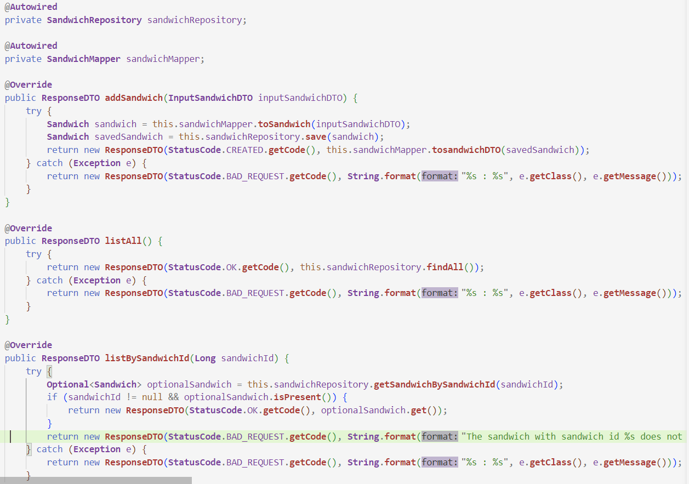

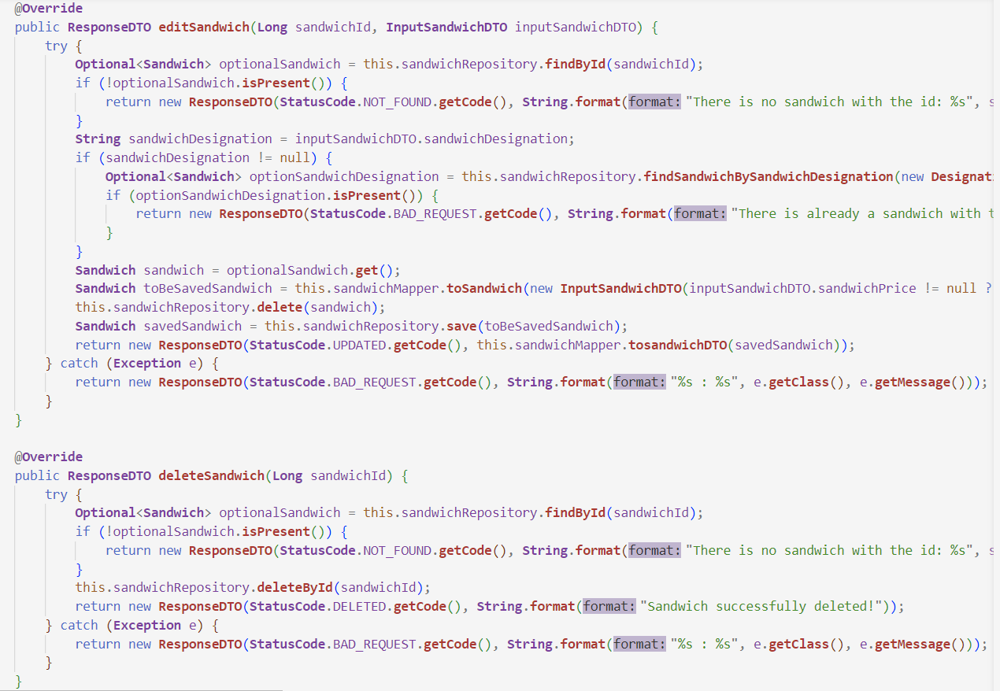

### Repository

The repository is used to create an abstraction layer between the data access layer and the business logic layer of an application. Implementation of repository patterns can help to abstract your  application from changes in the data store and can facilitate automated  unit testing.

The Repository class extends JpaRepository and often uses the methods implemented by the interface, such as findAll(), findById() and deleteById().
Often it is necessary to build a query in order to get the intended results. In the following image is an example of a query. The nativeQuery tag is used to be able to build the query in SQL instead of JPQL. The Modifying and Transactional tags are used for update and delete operations. The Param tag defines the name given to the attribute that will be inserted in the query.

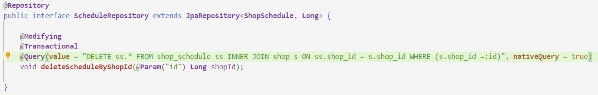

### Mapper

The mapper class is responsible for transforming domain objects into DTO and vice versa. This class is called when it is necessary to transform the DTO into dominium in order to be able to perform operations in the program, and from dominium into DTO when returning values to the user.

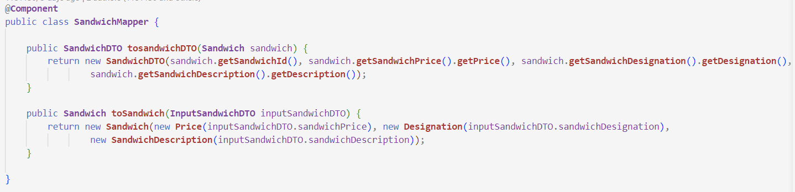

### DTO

DTO stands for Data Transfer Object, which is a design pattern. The DTO pattern serves to simplify the data, so that it is easier to then return the data to the user. It is also used as an input for data that is later converted to a domain object by the mapper.

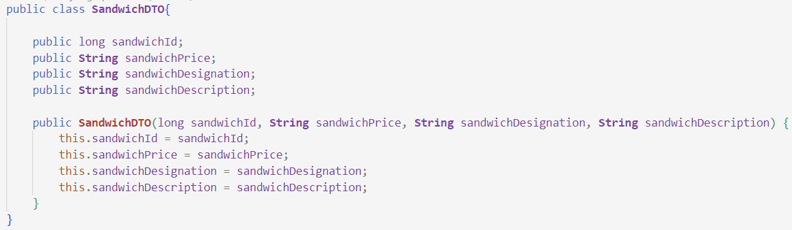

### Constants

The class constants is for registering all constants and checks via REGEX

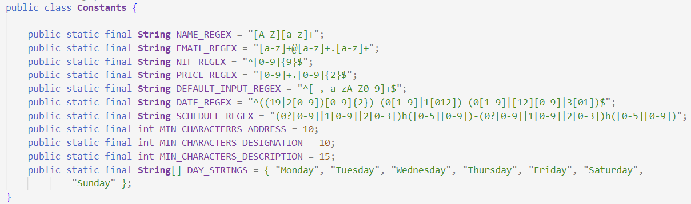

## Quality Assurance

| ID   | Quality Attribute                                       | Scenario                                                     | Associated Use Stories |
| ---- | ------------------------------------------------------- | ------------------------------------------------------------ | ---------------------- |
| QA1  | Usability,Performance                                   | The application must run on several browsers and devices     | All User Stories       |
| QA2  | Security, Modifiability                                 | Usage of Domain Primitives                                   | All User Stories       |
| QA3  | Modifiability                                           | The application must be suitable for future modification     | All User Stories       |
| QA4  | Testability, Performance, Modifiability, Maintainbility | The system must achive at least 70% of the level calculated for the code quality standards, through the Sonargraph-Explorer | All User Stories       |

The table above shows the quality standards applied in the solution. 

Regarding QA1, the application works via localhost and Swagger. Swagger is a platform whose function is to receive URL's and through them make REST requests to the solution. Besides this, it is capable of automatically generating API documentation.
This requirement was not completely fulfilled, because although it is possible to make requests through different computers and in different browsers, the application is not deployed at the moment. 

Regarding QA2 this was successfully achieved, since the system has value objects that are invariant and the checks on the constructors of the value objects are performed. An example of a Domain Property is the class NIF or Date, since these have unique and invariant checks.

Using SonarGraph it is possible to ascertain that the developed code has 90.48% maintainbility, which makes QA3 and QA4 successfully met. It can be concluded that good programming practices were used. 

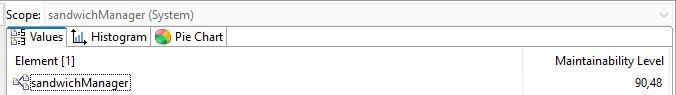

## CWT Mitigations

### CWE-476: NULL Pointer Dereference

A NULL pointer dereference occurs when the application dereferences a  pointer that it expects to be valid, but is NULL, typically causing a  crash or exit. 

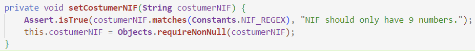

The requireNonNull method is used to check that the value entered is not null.

### CWE-766: Critical Data Element Declared Public

The software declares a critical variable, field, or member to be public when intended security policy requires it to be private.

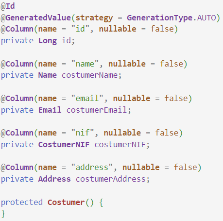

In all classes, their respective variables are all private so as not to be a vulnerability for the system.

### CWE-1099: Inconsistent Naming Conventions for Identifiers

The product's code, documentation, or other artifacts do not  consistently use the same naming conventions for variables, callables,  groups of related callables, I/O capabilities, data types, file names,  or similar types of elements.

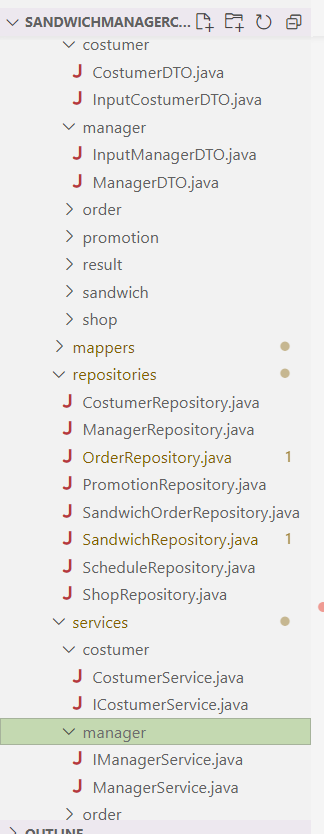

All files and variables follow the same predefined nomenclature

### CWE-1053: Missing Documentation for Design

The product does not have documentation that represents how it is designed. 

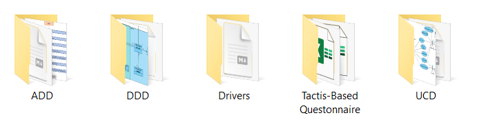

CRUD operation diagrams have been made, as all documentation regarding the DDD and the three ADD iterations.

### CWE-1054: Invocation of a Control Element at an Unnecessarily Deep Horizontal Layer

The code at one architectural layer invokes code that resides at a  deeper layer than the adjacent layer, i.e., the invocation skips at  least one layer, and the invoked code is not part of a vertical utility  layer that can be referenced from any horizontal layer. 

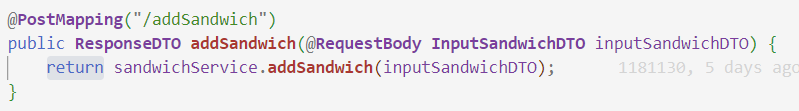

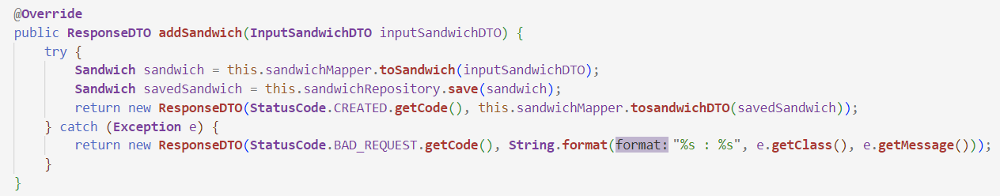

As can be seen from the images above, no layer has been bypassed. This is an example of how all the code was developed.

### CWE-1068: Inconsistency Between Implementation and Documented Design

The implementation of the product is not consistent with the design as described within the relevant documentation.

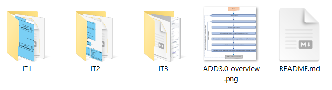

The entire development process was documented in all three iterations of ADD. Since each iteration is an upgrade of the previous one, there will be no discrepancies between what is implemented and what is developed.

