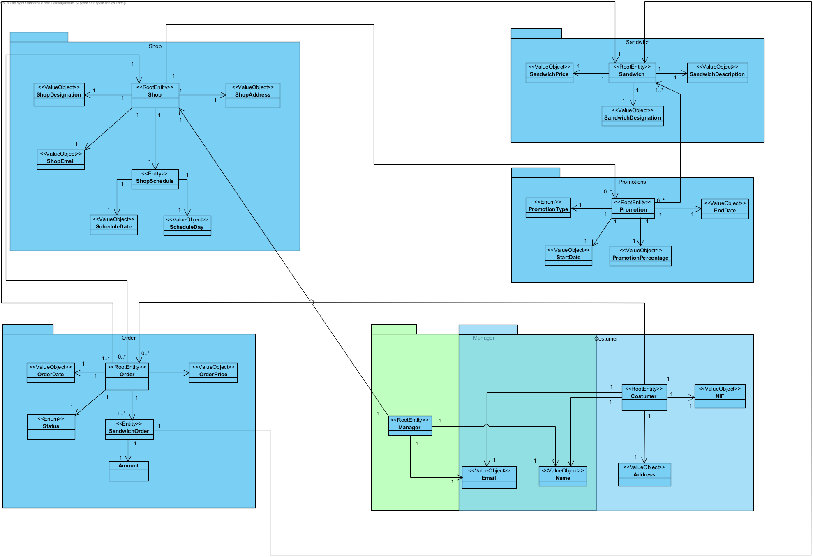
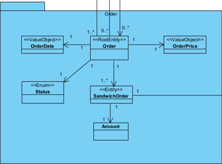
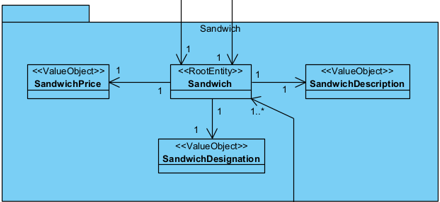
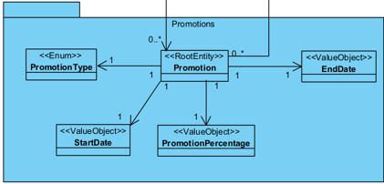
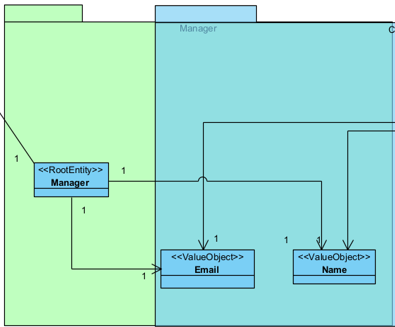
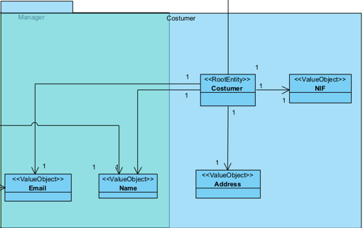

## Domain Model

## Shop Aggregate

The Shop aggregate is responsible for the Shop Entity and its designated Value Objects

- Root Entity
  - Shop

- Entity
  - ShopSchedule

- Value Object
  - ShopDesignation
  - ShopAddress
  - ShopSchedule
  - ScheduleDay
  - ScheculeDate

## Order Aggregate

The Order aggregate is responsible for the Order Entity and its designated Value Objects

- Root Entity
  - Order

- Entity
  - SandwichOrder

- Value Object
  - OrderPrice
  - Amount
  - Date

- Enum
  - OrderStatus
  
## Sandwich Aggregate

The Sandwich aggregate is responsible for the Sandwich Entity and its designated Value Objects

- Root Entity
  - Sandwich

- Value Object
  - SandwichDesignation
  - SandwichPrice
  - SandwichDescription
  
## Promotions Aggregate

The Promotions aggregate is responsible for the Promotions Entity and its designated Value Objects

- Root Entity
  - Promotion 
  
- Value Object
  - PromotionPercentage
  - StartDate
  - EndDate
  
- Enum
  - PromotionType 

## Manager Aggregate

The Manager aggregate is responsible for the Manager Entity and its designated Value Objects

- Root Entity
  - Manager
  
- Value Object
  - Email (shared between two aggregates)
  - Name (shared between two aggregates)

## Costumer Aggregate

The Costumer aggregate is responsible for the Costumer Entity and its designated Value Objects

- Root Entity
  - Costumer
  
- Value Object
  - CostumerNIF
  - CostumerAddress
  - Name (shared between two aggregates)
  - Email (shared between two aggregates)