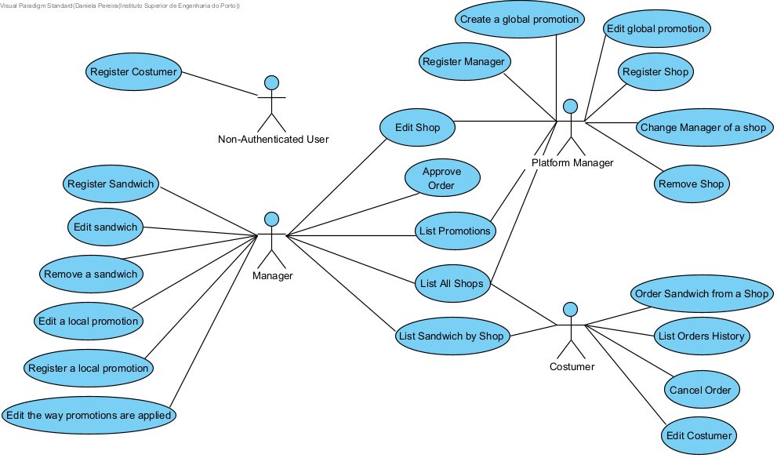

# Use Cases

## Diagram

##  Use Cases

| ID   | Description                            | Details                             |
| ---- | -------------------------------------- | ----------------------------------- |
| US1  | Register in the platform as a Manager  | Platform Manager can register a manager in the platform                    |
| US2  | Register in the platform as a Costumer | Non-Authenticated User can register himself in the platform as a costumer  |
| US3  | Change Manager of a Shop               | Platform Manager can change a shop's manager                               |
| US4  | Register Shop                          | Platform Manager can register a shop in the system                 |
| US5  | Edit Shop                              | Platform Manager and Manager can edit shop data           |
| US6  | Edit Costumer                          | Costumer can edit its account                           |
| US7  | Remove Shop                            | Platform Manager can remove a shop from the system                 |
| US8  | List all Shops                         | Platform Manager, Manager and Costumer can list all shops in the system |
| US9 | Create global promotions               | Platform Manager can add global promotions                   |
| US10 | Edit global promotions                 | Platform Manager can edit global promotions                 |
| US11 | Create local Promotion                 | Manager can create local promotions                             |
| US12 | Edit local Promotion                   | Manager can edit local promotions                            |
| US13 | Edit Promotion Application             | Manager can edit promotion applicatino                            |
| US14 | List Promotions                        | Manager and Costumer can list promotions                  |
| US15 | Register Sandwich                      | Manager can register a sandwich in the system                            |
| US16 | Edit Sandwich                          | Manager can edit a sandwich data                             |
| US17 | Remove Sandwich                        | Manager can remove a sandwich from the system                            |
| US18 | List all Sandwiches from Shop          | Manager and Costumer cam list all sandwiches from a shop                  |
| US19 | Order Sandwich                         | Costumer can create a sandwich order                           |
| US20 | Approve Order                          | Manager can approve a sandwich order                          |
| US21 | Cancel Order                           | Costumer can cancel a sandwich order                           |
| US22 | List Order History                     | Costumer can list his order history                           |

##  Constraints and Architectural Concerns

| Driver Type | Description                                                  |
| ----------- | ------------------------------------------------------------ |
| UC's        | All                                                          |
| Concerns    | CRN1: Establishing an overall initial system structure.      |
|             | CRN2: Some team elements inexperience with a Spring-based systems |
|             | CRN3: The teams reduced size                                 |
|             | CRN4 : Allocate the tasks to the members of the team         |
|             | CRN5 : Achiving the goal for the quality standards in a short amount of time |
| Constraints | CON1: The system is developed using Open-Source Technologies. |
|             | CON2: The application should be available in the near four weeks. |
|             | CON3: The system must achive at least 70% of the level calculated for the code quality standards, through the Sonargraph-Explorer |
|             | CON4: The API is to be then accessible through a single page application (SPA). |
|             | CON5 : The application must use Spring Technology            |
|             | CON6 : The system must ensure 99% of unauthorized login attempts are detected |
|             | CON7 :  The application must run on several browsers and devices |