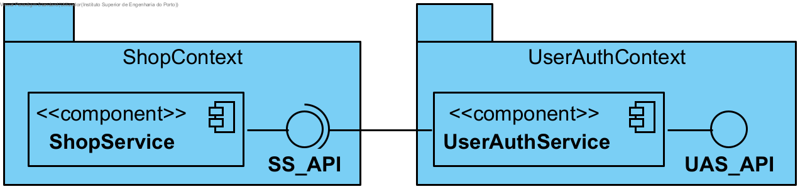
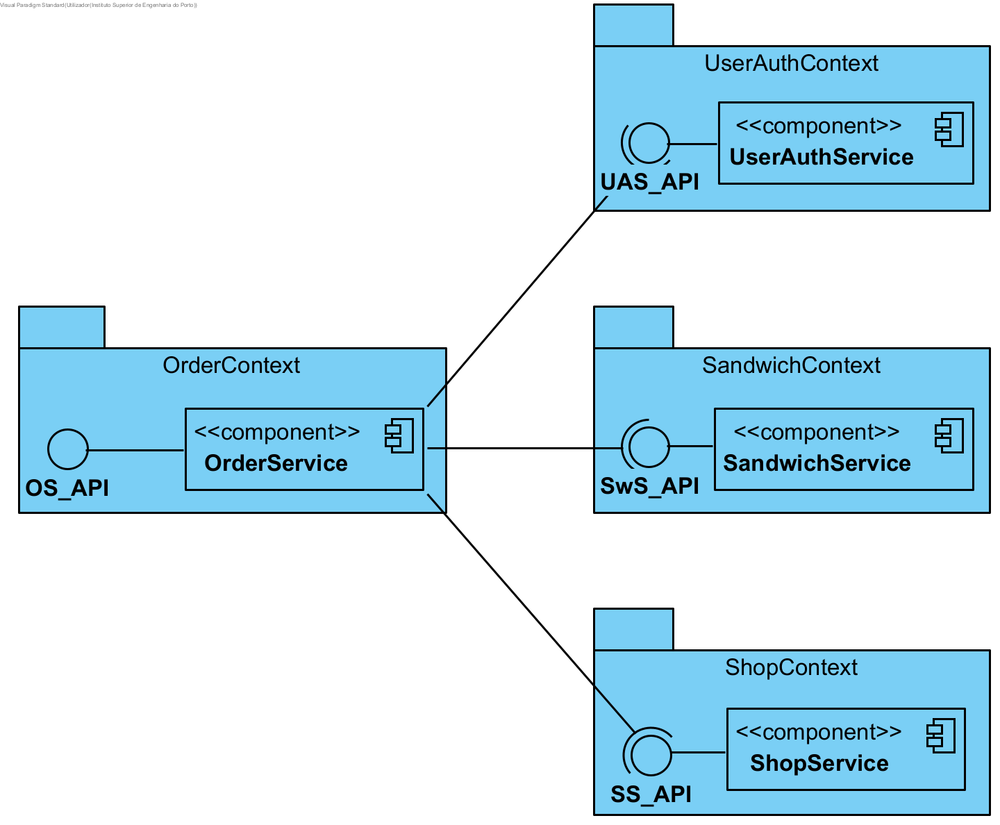
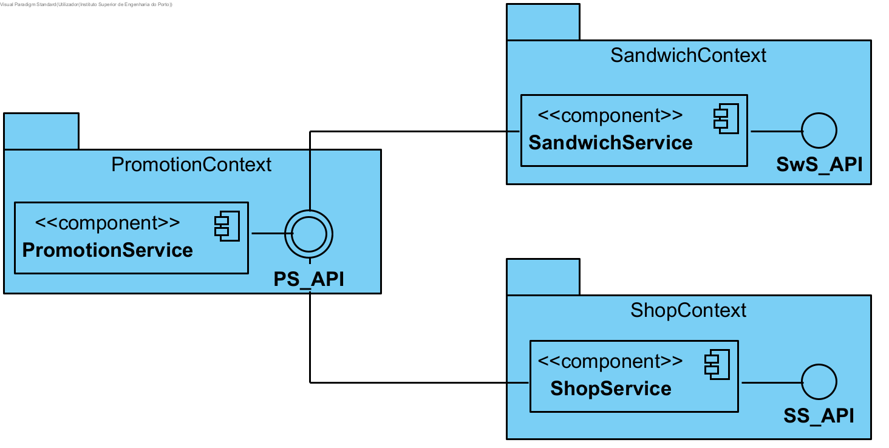

# ADD Iteration 1

## Step 1: Considered Inputs

### Descriptions

#### User Stories

| Name                 | Description                                                             |
| -------------------- | ----------------------------------------------------------------------- |
| US01 - Register User | As a User I want to register myself in the application so that I use it |

#### Quality Attributes

| Name&nbsp; &nbsp; &nbsp; &nbsp; &nbsp; &nbsp; &nbsp; &nbsp; &nbsp; &nbsp; &nbsp; &nbsp; &nbsp; &nbsp; &nbsp; &nbsp; &nbsp; &nbsp; &nbsp; &nbsp; &nbsp; &nbsp; &nbsp; &nbsp; &nbsp; &nbsp; &nbsp; &nbsp; &nbsp; &nbsp; &nbsp; &nbsp; &nbsp; &nbsp; &nbsp; &nbsp; &nbsp; &nbsp; &nbsp; &nbsp; &nbsp; &nbsp; | Description                                                                                                                                                                                              |
| --------------------------------------------------------------------------------------------------------------------------------------------------------------------------------------------------------------------------------------------------------------------------------------------------------- | -------------------------------------------------------------------------------------------------------------------------------------------------------------------------------------------------------- |
| QA1 - Maintainability                                                                                                                                                                                                                                                                                     | The prototype should be implemented in a way so that future problems/bugs found during the development, deployment and possibly support can be resolved quickly without major costs.                     |
| QA2 - Complexity                                                                                                                                                                                                                                                                                          | The complexity of prototype shouldn't surpass certain limits due to the simplicity of the context.                                                                                                       |
| QA3 - Modifiability                                                                                                                                                                                                                                                                                       | Future updates of the prototype should be simple and low cost. For example, the prototype must be implemented in a way that it will not fail if, for some reason, the ports of the services are changed. |
| QA4 - Scalability                                                                                                                                                                                                                                                                                         | The prototype must support scalability by thinking in future features that can be implemented. For example, the addition of a new microservice should be as simple as smooth as possible.                |

#### Concerns

| Name&nbsp; &nbsp; &nbsp; &nbsp; &nbsp; &nbsp; &nbsp; &nbsp; &nbsp; &nbsp; &nbsp; &nbsp; &nbsp; &nbsp; &nbsp; &nbsp; &nbsp; &nbsp; &nbsp; &nbsp; &nbsp; &nbsp; &nbsp; &nbsp; &nbsp; &nbsp; &nbsp; &nbsp; &nbsp; &nbsp; &nbsp; &nbsp; &nbsp; &nbsp; &nbsp; &nbsp; &nbsp; &nbsp; &nbsp; &nbsp; &nbsp; &nbsp; | Description                                                                                                                                                                  |
| --------------------------------------------------------------------------------------------------------------------------------------------------------------------------------------------------------------------------------------------------------------------------------------------------------- | ---------------------------------------------------------------------------------------------------------------------------------------------------------------------------- |
| CON1 – Prototype accessible from the web                                                                                                                                                                                                                                                                 | The developed prototype must be accessible using a web browser.                                                                                                              |
| CON2 – Developer staff and deadline                                                                                                                                                                                                                                                                      | `<span>`The team must develop the prototype in six weeks, being the delivery deadline on the 22nd of December of 2022.`</br>`The team was constituted by four members.  |
| CON3 – Authentication and Authorization                                                                                                                                                                                                                                                                  | The prototype must contain Authentication, so that only registered user can access it, and Authorization, so that certain features can be limited to certain users.          |
| CON4 – Multiple ports                                                                                                                                                                                                                                                                                    | With multiple microservices, using different ports, there can be confusion in the frontend (Single Page Application) on which port to call.                                  |

#### Architectural Constraints

| Name&nbsp; &nbsp; &nbsp; &nbsp; &nbsp; &nbsp; &nbsp; &nbsp; &nbsp; &nbsp; &nbsp; &nbsp; &nbsp; &nbsp; &nbsp; &nbsp; &nbsp; &nbsp; &nbsp; &nbsp; &nbsp; &nbsp; &nbsp; &nbsp; &nbsp; &nbsp; &nbsp; &nbsp; &nbsp; &nbsp; &nbsp; &nbsp; &nbsp; &nbsp; &nbsp; &nbsp; &nbsp; | Description                                                                                                                                       |
| ---------------------------------------------------------------------------------------------------------------------------------------------------------------------------------------------------------------------------------------------------------------------- | ------------------------------------------------------------------------------------------------------------------------------------------------- |
| CRN1 - Microservices                                                                                                                                                                                                                                                   | The monolithic developed in the first part of the project must be divided into microservices.                                                     |
| CRN2 – Data Migration                                                                                                                                                                                                                                                 | The data in the monolithic, developed in the first part of the project, must be migrated to their respective new database (in each microservice). |
| CRN3 - Deployment                                                                                                                                                                                                                                                      | The deployment of the prototype should be, ideally, based on containers.                                                                          |

#### Technology Constraints

| Name&nbsp; &nbsp; &nbsp; &nbsp; &nbsp; &nbsp; &nbsp; &nbsp; &nbsp; &nbsp; &nbsp; &nbsp; &nbsp; &nbsp; &nbsp; &nbsp; &nbsp; &nbsp; &nbsp; &nbsp; &nbsp; &nbsp; &nbsp; &nbsp; &nbsp; &nbsp; &nbsp; &nbsp; &nbsp; &nbsp; &nbsp; &nbsp; &nbsp; &nbsp; &nbsp; | Description                                                                                                                                       |
| -------------------------------------------------------------------------------------------------------------------------------------------------------------------------------------------------------------------------------------------------------- | ------------------------------------------------------------------------------------------------------------------------------------------------- |
| TC1 – The use of two or more programming languages                                                                                                                                                                                                      | The prototype must be developed using two, or more, programming languages.                                                                        |
| TC2 – Open-source tools only                                                                                                                                                                                                                            | Only open-source tools are allowed in the development of the prototype.                                                                           |
| TC3 - GraphQL                                                                                                                                                                                                                                            | The team must analyse GraphQL and its suitability to the project. However, the tool might, or not, be used in the final version of the prototype. |
| TC4 - Open API (Swagger)                                                                                                                                                                                                                                 | The Open API (Swagger) must be used for the documentation of the API.                                                                             |
| TC5 - ContextMapper                                                                                                                                                                                                                                      | ContextMapper must be used for the creation of a context map.                                                                                     |

### Priorities

#### User Story

| Name                 | Importance | Difficulty |
| -------------------- | ---------- | ---------- |
| US01 - Register User | High       | High       |

#### Quality Attributes

| Name                   | Importance | Difficulty |
| ---------------------- | ---------- | ---------- |
| QA1 – Maintainability | High       | Medium     |
| QA2 – Complexity      | Medium     | Low        |
| QA3 – Modifiability   | High       | Medium     |
| QA4 - Scalability      | Low        | Medium     |

#### Concerns

| Name                                      | Importance | Difficulty |
| ----------------------------------------- | ---------- | ---------- |
| CON1 – Prototype accessible from the web | High       | Medium     |
| CON2 – Developer staff and deadline      | High       | High       |
| CON3 – Authentication and Authorization  | High       | Medium     |
| CON4 – Multiple ports                    | Medium     | Medium     |

#### Architectural Constraints

| Name                   | Importance | Difficulty |
| ---------------------- | ---------- | ---------- |
| CRN1 – Microservices  | High       | High       |
| CRN2 – Data Migration | High       | High       |
| CRN3 – Deployment     | High       | High       |

#### Technology Constraints

| Name                                                | Importance | Difficulty |
| --------------------------------------------------- | ---------- | ---------- |
| TC1 – The use of two or more programming languages | High       | Medium     |
| TC2 – Open-source tools only                       | High       | Low        |
| TC3 - GraphQL                                       | Medium     | High       |
| TC4 - Open API (Swagger)                            | High       | Medium     |
| TC5 - ContextMapper                                 | Medium     | Medium     |

## Step 2: Establish iteration goal and select inputs to be considered in the iteration

The iteration goal is to decompose the monolithic into microservices while addressing the following main drivers:

```
* User Stories: US1
* Quality Attributes: QA1
* Concerns: CON3
* Architecture Constraints: CRN1, CRN2, CRN3
* Technology Constraints: TC1, TC3, TC4
```

## Step 3: Choose one or more elements of the system to decompose.

The elements to refine are the previously mentioned drivers.

The monolithic will be decomposed into microservices.

## Step 4: Choose design concepts that satisfy the selected drivers

| Design Decisions and Location                               | Rationale and Assumptions                                                                                                                                                                                  |
| ----------------------------------------------------------- | ---------------------------------------------------------------------------------------------------------------------------------------------------------------------------------------------------------- |
| Update the existing Domain Driven Model for the application | The diagram describing the relationships between the different aggregate roots, entities and value objects, created in the first part of the project, must be updated due to the addition of new features. |
| Create a Context Map for the application                    | A context map specifying all the contexts of the application and their relationships must be created.                                                                                                      |
| Create a Deployment Diagram for the application             | There must be a diagram describing the different components and their interactions.                                                                                                                        |
| Create Sequence Diagrams for the application                | Diagrams to demonstrate the flux of information related to the primary features.                                                                                                                           |
| Create a Components Diagrams for the application            | There must be a diagram describing the different components and their interactions.                                                                                                                        |

## Step 5: Instantiate architectural elements, allocate responsibilities, and define interfaces

### MicroService Migration

The monolithic was decomposed into microservices by root entities defined in the **Domain Driven Model**. This can also be seen as business capabilities.

| Microservice Name | Business  Capability  | Responsibility                                          |
| ----------------- | --------------------- | ------------------------------------------------------- |
| User Auth         | User management       | Management of users, authentication and authorization.  |
| Sandwich          | Sandwich Management   | Management of sandwichs.                                |
| Order             | Order Management      | Management of orders made by costumers.                 |
| Shop              | Shop Management       | Management of shops.                                    |
| Promotions        | Promotions Management | Management of local and global promotions of sandwichs. |

In the first part of the project, it was decided to merge the manager and costumer aggregate in the microservice User Auth to address **CON3**.

### Patterns

| Pattern                   | Description                                                                                                                                                                                                                                                                                                                                                                                |
| ------------------------- | ------------------------------------------------------------------------------------------------------------------------------------------------------------------------------------------------------------------------------------------------------------------------------------------------------------------------------------------------------------------------------------------ |
| Strangler Fig Apllication | This pattern aims to incrementally re-write small parts of the codebase until we have strangled all our old codebase and we can be totally removed it. Using this pattern rollbacks are easier, reduces the risks when the codebase is updated.<br />https://www.freecodecamp.org/news/what-is-the-strangler-pattern-in-software-development/                                              |
| API Composition           | It is a run-time composition that loads data in-memory through an API Composer Service built on the top of two or more services. This pattern should be used whenever is possible, but because of its in-memory load nature must be used carefully and only when the data to load is relatively small. https://www.linkedin.com/pulse/api-composition-pattern-microservices-arpit-bhayani/ |

### Microservice Comunication

## Step 6: Sketch views and record design decisions

### Domain Driven Design


The Domain Driven Design model remains almost the same. The updates were:

**User Aggregate**

The Manager Aggregate and Costumer Aggregate in order to address the **CON3**. The User class has the attributes for the authentication and authorization and is the superclass of Manager and Costumer. Manager and Costumer classes remains with their unique attributes from the last iteration.

### Component Diagrams

In order to increase the visibility of the component diagrams, the group decided to create one diagram for each context with the connections/binding made to its API.



UserAuthService uses the Shop API to verify if the shop associated to the manager exists.



OrderService uses the Shop API to verify if the shop associated to the order exists.

OrderService uses the UserAuth API to verify if the costumer associated to the order exists.

OrderService uses the Sandwich API to retrieve all the sandwiches within an order.



SandwichService uses the Promotion API to retrieve the promotions of a sandwich.

ShopService uses the Promotion API to retrieve the promotions of a shop.

### Context Map


The context map describes the different microservices that were created for the prototype, having the monolithic built in the first part in mind. The team achieved, after many meetings, this context map that explains and demonstrates how the contexts communicate with each other. The definition of some properties used in the context map are explained below.

* OHS (Open Host Service): This protocol defines and gives access to different contexts, which means that it can communicate with other bounded contexts through domain events that use different bounded context.
* Upstream and Downstream: Upstream term define the context that transmit information/data to other contexts and can influence the downstream contexts. Upstream contexts usually have impact in different context because of the fact that they have data for the other contexts to work properly.

## Step 7: Analyse current design, and review iteration goal + achievement of design purpose

|              |     Iteration 1     |                      |
| :-----------: | :-----------------: | :------------------: |
| Not Addressed | Partially Addressed | Completely Addressed |
|     CRN3     |         QA4         |         QA1         |
|      TC1      |        CON3        |         QA3         |
|       -       |        CON4        |         TC2         |
|       -       |        CRN1        |         TC4         |
|       -       |        CRN2        |         TC5         |
|       -       |         TC3         |          -          |
