# Second Iteration

## Step 1: Considered Inputs

This iteration there weren't inputs updates.

## Step 2: Establish iteration goal

The iteration goal is to re-evaluate the microservices communication and create a data migration process. The drivers related to this are the following:

**CRN1** – Microservices;

**CRN2** – Data Migration;

**CRN3** – Deployment.

Acording QA1 is expected to have a high percentage of maintenability. Using the sonorgraph this percentage for the project and for each microservice was measured respectively:

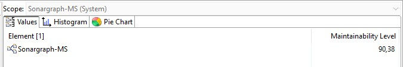

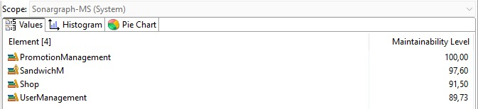

## Step 3: Choose what to refine

The elements to refine is the communication between microservices, that at the moment are made by HTTP requests and must be by GraphQL requests.

## Step 4: Choose design concepts that satisfy the selected drivers

---

| Design Decisions and Location                       | Rationale and Assumptions                                                                                           |
| --------------------------------------------------- | ------------------------------------------------------------------------------------------------------------------- |
| Create a Microservices Communication Diagram        | The diagram describing the communication between the different microservices.                                       |
| Create a Components Diagrams for the data migration | There must be a diagram describing the different components, involved in the data migration and their interactions. |
| Create a Deployment Diagram                         | There must be a diagram describing the deployment of the prototype.                                                 |

## Step 5: Instantiate architectural elements, allocate responsibilities, and define interfaces

### Data Migration

The team members never migrated a monolithic project to a microservices project so firstly we decided follow step by step the Strangler Fig Apllication pattern.

#### Step 1

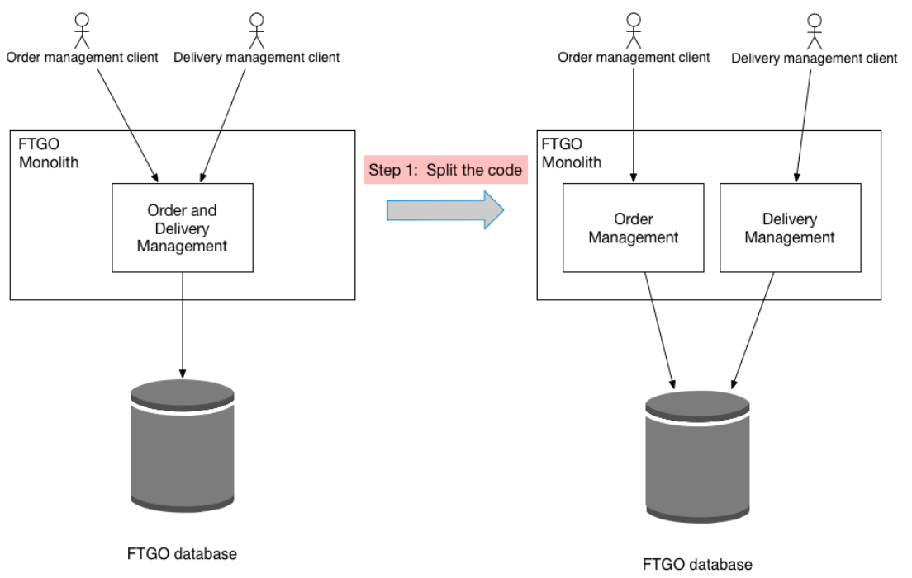

The first step consists in separate the codebase in different aggregates. This step was already done for the project first iteration.

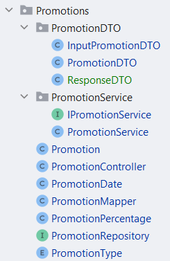

#### Step 2

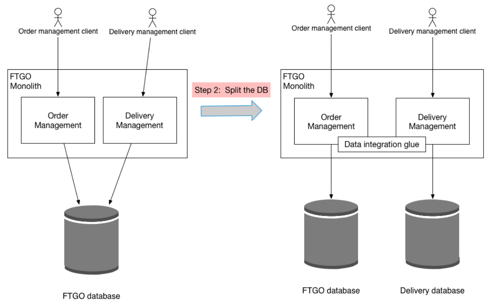

Secondly is needed to create a new database for the aggregate that will be converted to a microservice. Besides that is necessary to have communication beetween aggregates by the data integration glue (foreign keys beetween aggregates database tables).

The database creation:

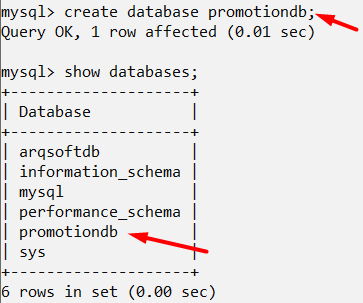

Data Integration Glue:

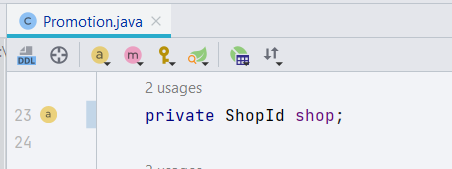

Now is not used the object shop but the shop Id.

#### Step 3

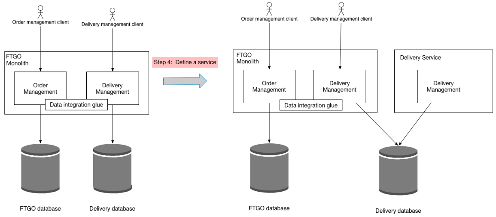

The next step is to create a new project that is going to be the new microservice, deploy it and connect it to the database created in the step before.

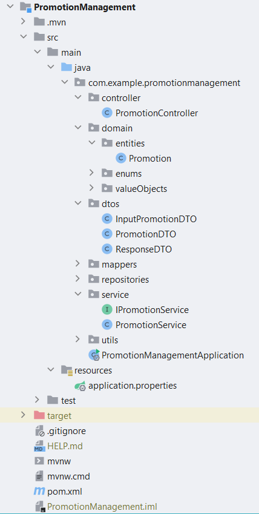

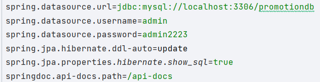

#### Step 4

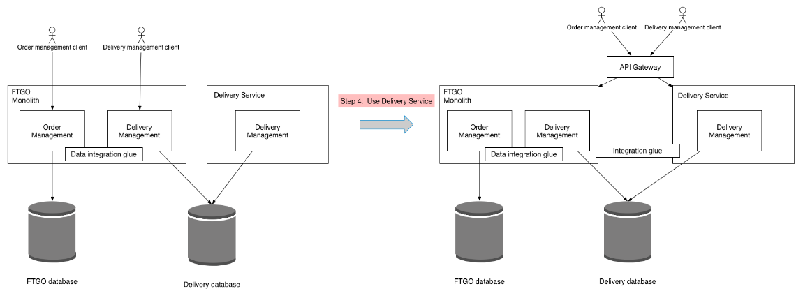

In this step the client does not communicate anymore directly with the monolith management solution but by an API Gateway. Besides that, the codebase is gradually being copied and tested from the monolith solution to the new microservice.

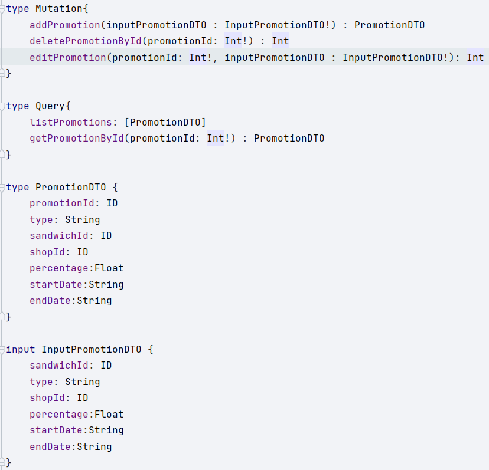

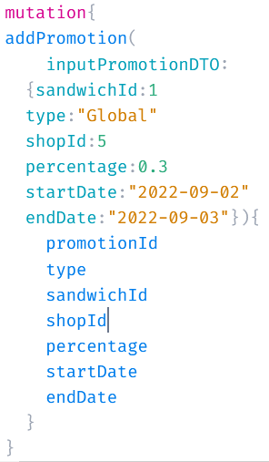

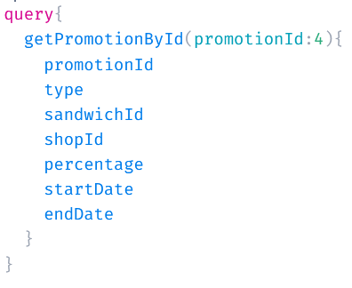

#### Step 5

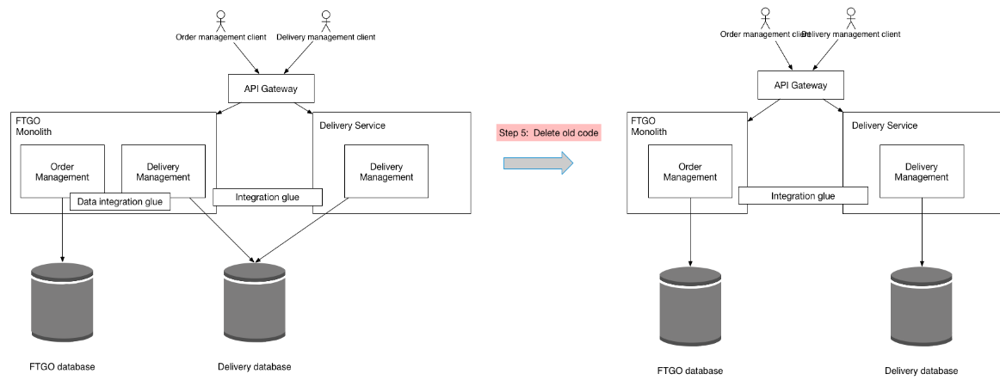

The final step is delete the aggregate codebase that was copied to the new microservice.

This is a valid way of data migration and also go to the encounter the selected drivers of scalability, maintainability and modifiability.

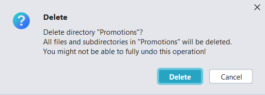

### GraphQL

GraphQL is a query language that allows the user to request only the information that he needs. The APIs are organized in terms of types and fields, not endpoints so, we can access the full capabilities of our data from a single endpoint. With GraphQL, the addition of new fields and types to an API dont affect the already existing queries, helping in the modifiability of the application.

The monolith application was built in a way that all request answer with a generic answer (ResultDTO, composed by a generic object_Result, responsible for retrieving the data or an error message, and a statusCode that allows the requester to know the code of the answer). Due to that generic implementation, the team was not able to implement the framework. One way to resolve this problem is to use the *JSON.stringify()* but using this method there isn't any purpose to use GraphQL. So, instead to return ResultDTO, will be returned the DTO itself. For that reason, any exception raised in the process of the query or mutation, will result in a GraphQL Error since he cannot return the expected DTO.

Nevertheless, the team was able to understand the advantages of a framework like GraphQL. The customization in every request is in fact an asset that will increase the performance of most applications, especially if the applications have microservices communicating with each others.

### Swagger 

Swagger allows you to describe the structure of your APIs so that machines can read them. The ability of APIs to describe their own structure is the root of all awesomeness in Swagger. Why is it so great? Well, by reading your API’s structure, we can automatically build beautiful and interactive API documentation. We can also automatically generate client libraries for your API in many languages and explore other possibilities like automated testing.

 As such Swagger is build for a different ecosystem. Swagger adds functionality to REST that works out of the box in GraphQL. So as far as known there are no attempts from either side to create compatibility. There are some tools to expose Swagger/OpenAPI REST endpoints as GraphQL queries, which can be interesting for a transition period. However, in this project there was no possibility to fully integrate swagger with the operations developed and documented through GraphQL.

### Deployment

Docker will be used to create containers for the different components and microservices of the prototype.

## Step 6: Sketch views and record design decisions

### Service Discovery Diagram

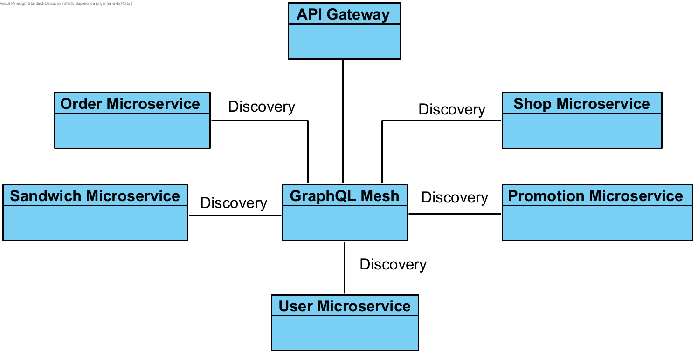

GraphQL Mesh represents a central server that will register all the microservices, within the network. The addresses are composed by the host and port.

The other microservices comunicate by the GraphQL Mesh in the central server, giving its information to be used.

All the microservices registered in the central server are available for everyone to use. To use them it's not necessary to know the address, just the name.

### Component Diagram

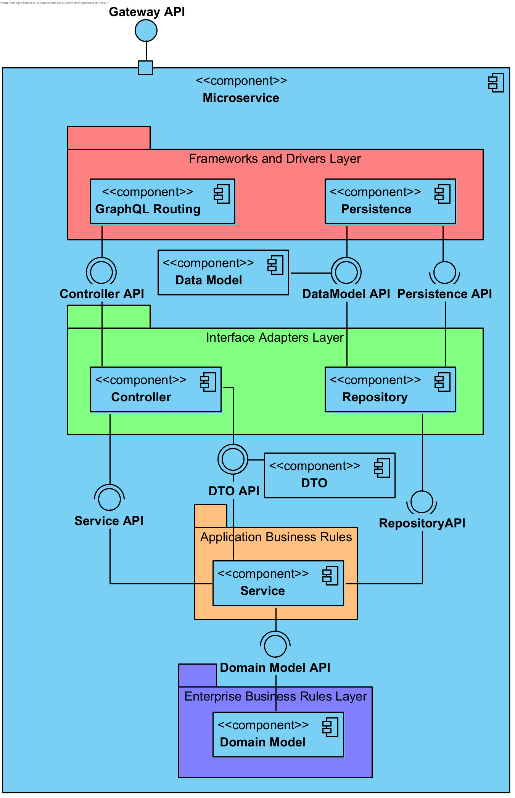

In the monolitic application the onion architeture was used and the team decided to implement each microservice with the same architeture because it's the one the team is used to work. The main difference are in the routing, now is done by GraphQL instead of HTTP and there is an API Gateway.

### Deployment Diagram

Docker is the tool that supports the deployment of the system. There is a big container which will have smaller one with each microservice and respetective database.

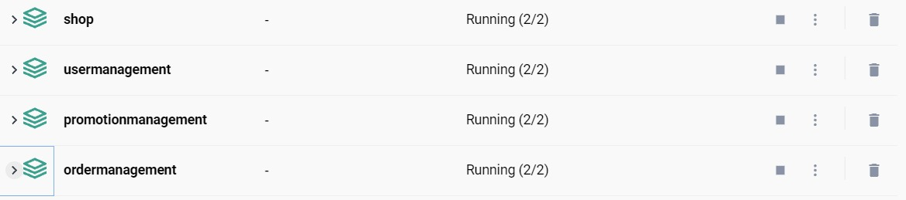

## Step 7: Analyse current design, and review iteration goal + achievement of design purpose

### Kanban Board

|              |     Iteration 2     |                      |
| :-----------: | :-----------------: | :------------------: |
| Not Addressed | Partially Addressed | Completely Addressed |
|       -       |         QA4         |         QA1         |
|       -       |        CON1        |         QA3         |
|       -       |          -          |         TC1         |
|       -       |          -          |         TC2         |
|       -       |          -          |         TC3         |
|       -       |          -          |         TC4         |
|       -       |          -          |         TC5         |
|       -       |          -          |         CRN1         |
|       -       |          -          |         CRN2         |
|       -       |          -          |         CRN3         |
|       -       |          -          |         CON2         |
|       -       |          -          |         CON3         |
|       -       |          -          |         CON4         |

### Road Map

| Person |          Work          |      Completed      |
| :-----: | :---------------------: | :------------------: |
|  Luís  |   Promotion Migration   | Completely Addressed |
|  Luís  | GraphQL Implementation | Completely Addressed |
|  Luís  |   ADD - 1st Iteration   | Completely Addressed |
|  Luís  |   ADD - 2nd Iteration   | Completely Addressed |
|  Luís  |          ATAM          | Completely Addressed |
| Daniel |   Sandwich Migration   | Completely Addressed |
| Daniel | GraphQL Implementation | Completely Addressed |
| Daniel |   ADD - 1st Iteration   | Completely Addressed |
| Daniel | Gateway Implementation | Partially Addressed |
|   Rui   |     Shop Migration     | Completely Addressed |
|   Rui   | GraphQL Implementation | Completely Addressed |
|   Rui   |   ADD - 1st Iteration   | Completely Addressed |
|   Rui   | Contract-based testing | Partially Addressed |
| Daniela |  US01 - Register User  | Completely Addressed |
| Daniela |     User Migration     | Completely Addressed |
| Daniela |     Order Migration     | Completely Addressed |
| Daniela | GraphQL Implementation | Completely Addressed |
| Daniela |       Deployment       | Partially Addressed |
