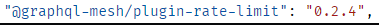
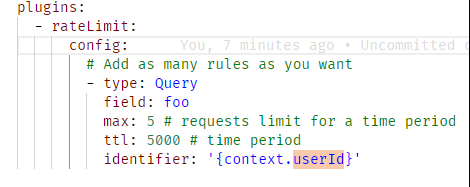

# Architecture Trade-off Analysis Method (Lightweight ATAM)

## Risks

One of the risks of the previous part remains, currently there is no data backup, which means that, if for some reason, there is a data corruption or a database delition by accident, it won't be possible to be restore the data to its original format. However, this its not a big risk due to the size of the project.
GraphQL [Denial of Service](https://security.snyk.io/vuln/SNYK-JS-GRAPHQLUPLOAD-72543) also represents a risk to the project. One way to solve part of this problem is to implement the GraphQL with a version higher than 7.0.0, so the team used 16.6.0 version. After five tries the application is blocked for five seconds due to the rate limit plugin. The number of tries and the seconds are configurable.

## Non-Risks

The use of Spring framework, Java, ASP.NET and MySQL as they are tested and stable tools.
The services discovery tool used, GraphQL Mesh, can also be seen as a non-risks due to its usability, testability and support.
Due to the use of value objects and domain primitives the validation of entity properties is validated upon the instantiation of the object (Fast Fail).
All exceptions raised within the system are caught and processed.
A secure authentication method is used to prevent the access to functionalities restricted to a specific user type.

## Sensitivity point

One possible sensitive point can be the user authentication server, that when down, will prevent the use of the prototype due to security purposes.

## Trade-off

The API Gateway can be seen as a trade-off since it adds more complexity to the prototype. The GraphQL Playground interface must communicate with the gateway instead of communicating directly with the target microservices, which will reduce performance. The team thinks this decision is the most correct since it keeps the prototype more organized and maintainable.
Another trade-off is the use of service discovery (GraphQL Mesh) which, besides requiring more time for implementation, it also adds more complexity. Although, it increases the security, by hiding the microservices addresses, it also increases the scalability of the prototype.
The data migration is also a topic that has to be discussed under this subject. The inexperience in data migration added more complexity and workload to the team, but, after a study the team came across with a solution that easily increases the modifiability, scalability and maintainability of the project.

## Risk Matrix

| Risk Criteria | Scalability | Availability | Performance | Security | Data Integrity | Total Risk |
| ------------- | ----------- | ------------ | ----------- | -------- | -------------- | ---------- |
| US01          |             |              |             |          |                |            |
| QA1           | 2           | 7            | 3           | 8        | 8              | 28         |
| QA2           | 2           | 7            | 4           | 8        | 8              | 29         |
| QA3           | 2           | 6            | 4           | 9        | 8              | 29         |
| QA4           | 2           | 6            | 4           | 9        | 8              | 28         |

Low : [0-3]	Medium : [4-6]	High : [7-9]
