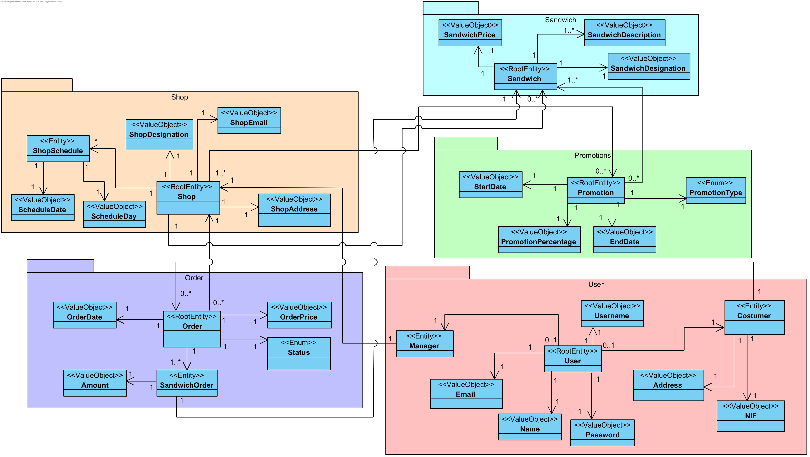
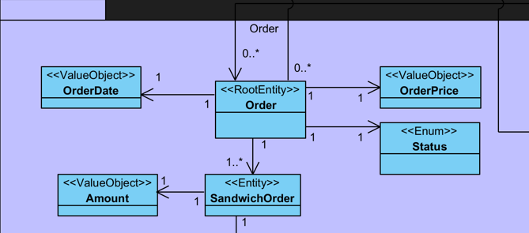
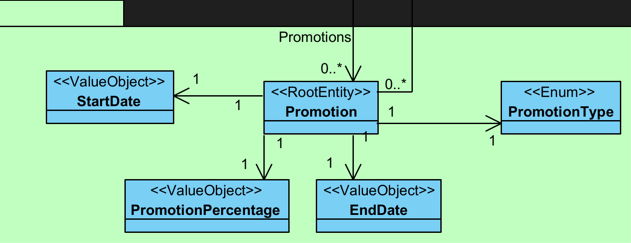
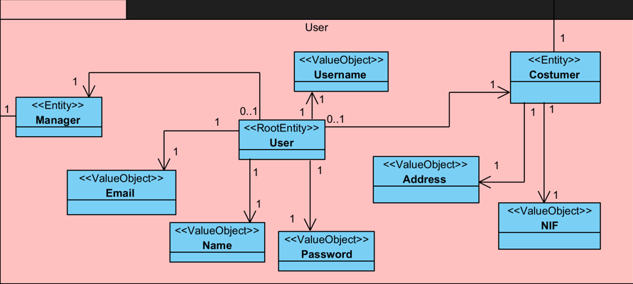

## Domain Model

## Shop Aggregate

The Shop aggregate is responsible for the Shop Entity and its designated Value Objects

- Root Entity
  - Shop
- Entity
  - ShopSchedule
- Value Object
  - ShopDesignation
  - ShopEmail
  - ShopAddress
  - ScheduleDay
  - ScheculeDate

## Order Aggregate

The Order aggregate is responsible for the Order Entity and its designated Value Objects

- Root Entity
  - Order

- Entity
  - SandwichOrder

- Value Object
  - OrderPrice
  - Amount
  - OrderDate

- Enum
  - Status
  
## Sandwich Aggregate

The Sandwich aggregate is responsible for the Sandwich Entity and its designated Value Objects

- Root Entity
  - Sandwich

- Value Object
  - SandwichDesignation
  - SandwichPrice
  - SandwichDescription
  
## Promotions Aggregate

The Promotions aggregate is responsible for the Promotions Entity and its designated Value Objects

- Root Entity
  - Promotion 
  
- Value Object
  - PromotionPercentage
  - StartDate
  - EndDate
  
- Enum
  - PromotionType 

## User Aggregate

The Useraggregate is responsible for the Manager and Costumer Entity and their \designated Value Objects

- Root Entity
  - User
- Entity
  - Manager
  - Costumer
- Value Object
  - Email (shared between Manager and Costumer)
  - Name (shared between Manager and Costumer)
  - Username (shared between Manager and Costumer)
  - Password (shared between Manager and Costumer)
  - Address (Costumer only)
  - NIF (Costumer only)
